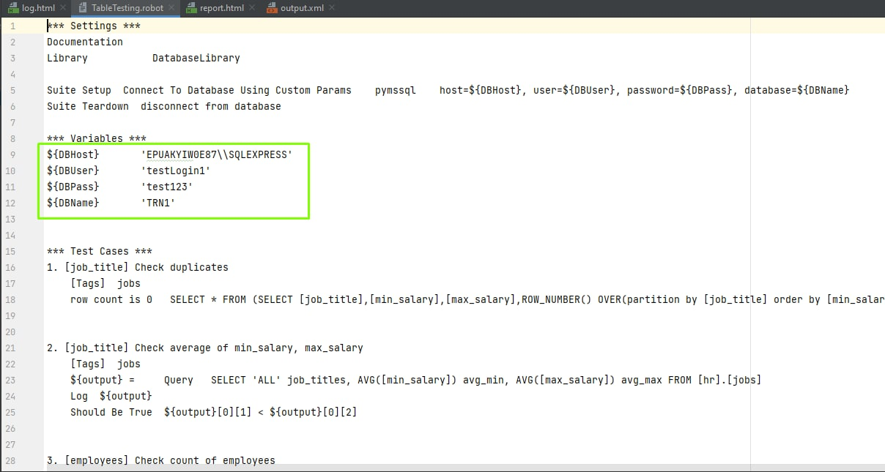
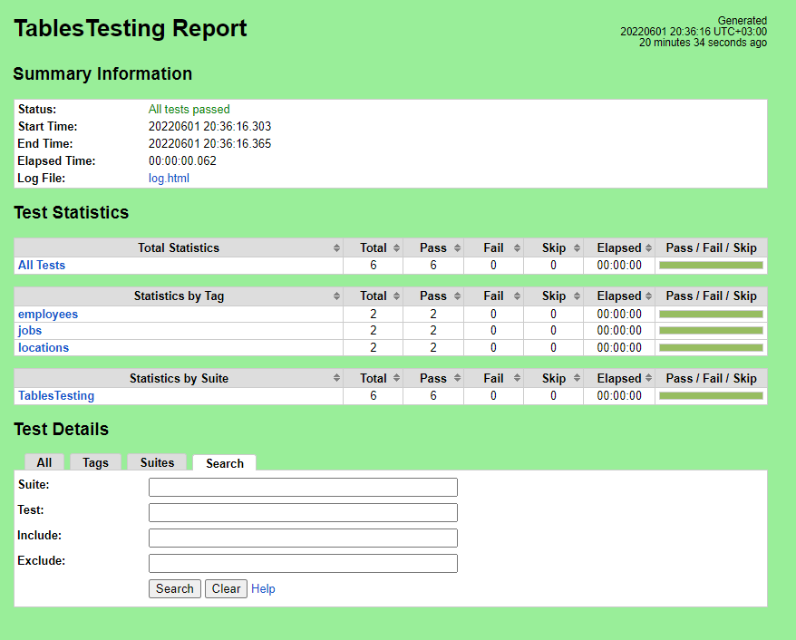

# RobotFrameworkTestTask

Test Automation for Data Quality Engineers - Robot Framework test task

# Steps fot setup
1. Clone repository
2. Install requirements.txt by pip ('pip install -r requirements.txt')
3. Create new login in MS SQL SMS. Save username, password, servername and name of DB.
    
4. Update values in project from previous step:
    
5. Open comand line or etc in ProjectFiles folder and run followerd command 'robot TablesTesting.robot'

# Report example
It's preview:
    

You can look at whole report by open [this file](https://git.epam.com/yurii_hordiichuk/robotframeworktesttask/-/blob/main/ProjectFiles/report.html) in browser.

# If not work and problem like from db side:
1. Check settings in  SQL Server Configuration Manager -> SQL Server Network Configuration -> Protocols for <SQLEXPRESS> -> TCP/IP Properties -> IP Addresses
2. At least one ip address may be active and enabled 
